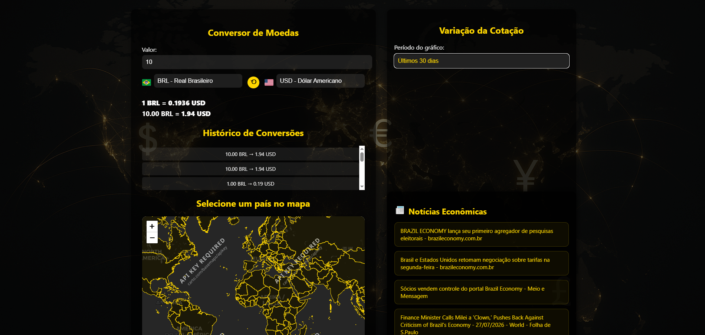

# Conversor de Moedas

Aplicação web para conversão de valores entre moedas, consulta de cotações e visualização de informações econômicas em uma interface responsiva.

## Preview



## Funcionalidades

- Conversão de valores entre diferentes moedas
- Exibição da taxa de câmbio utilizada na conversão
- Histórico das conversões realizadas
- Visualização da variação da cotação por período
- Gráfico de cotação
- Mapa interativo para seleção de países
- Notícias relacionadas ao cenário econômico
- Interface responsiva
- Estrutura preparada para utilização como aplicação web/PWA

## Interface

A aplicação concentra as principais informações em uma única interface:

- Área de conversão com valor de entrada e seleção das moedas
- Indicador da taxa de câmbio atual
- Histórico das operações realizadas
- Área gráfica para acompanhamento da cotação
- Mapa interativo
- Painel de notícias econômicas

## Tecnologias e integrações

A implementação utiliza tecnologias web para construção da interface, processamento das conversões e integração com serviços externos de dados.

> As tecnologias e APIs específicas devem ser atualizadas de acordo com a versão atual do código-fonte do repositório.

## Estrutura

```text
/
├── assets/
│   └── preview.png
├── docs/
└── README.md
```

A estrutura acima representa apenas os arquivos de documentação incluídos neste pacote. A estrutura completa do projeto deve ser mantida conforme o repositório original.

## Execução

Caso o projeto utilize Node.js:

```bash
npm install
npm run dev
```

Para uma versão estática, abra o arquivo de entrada da aplicação através de um servidor HTTP local.

## Objetivo do projeto

O projeto foi desenvolvido para centralizar conversão de moedas e informações relacionadas ao mercado financeiro em uma interface única, combinando consulta de dados, histórico, visualização gráfica e recursos geográficos.

## Responsividade

A interface foi projetada para adaptação a diferentes tamanhos de tela, mantendo os principais recursos acessíveis em desktop e dispositivos móveis.

## Autor

**Yuri**

Desenvolvedor Full Stack
